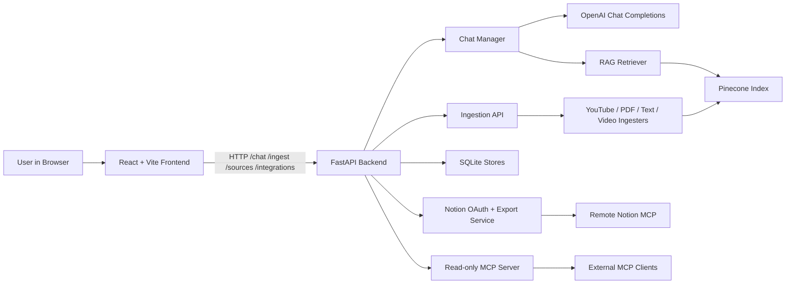

# Tailored.ai

Tailored.ai is a local-first AI assistant for ingesting source material such as YouTube videos, PDFs, text files, and uploaded video files, indexing that content for retrieval, and using OpenAI models to answer grounded questions with citations. It also includes a Notion export flow for saving thread summaries and a read-only MCP server for exposing chat history to external MCP-capable clients.

## Use Case

The app is built for a workflow like this:

1. Ingest source content into the system.
2. Create a chat session tied to a user and model.
3. Ask questions against the ingested material.
4. Review grounded answers with citations to the source content.
5. Optionally export the thread summary to Notion or access thread data through the MCP server.

## Key Features

- Ingest YouTube videos, PDFs, text files, and video uploads.
- Run RAG-backed chat against indexed content with citations.
- Use a React frontend for interactive chat and source management.
- Export thread summaries to Notion through an OAuth-based integration.
- Expose stored thread data through a read-only MCP server.

## Tech Stack

### Frontend

- React 19
- TypeScript
- Vite
- Tailwind CSS
- Vitest

### Backend API

- Python 3.12+
- FastAPI
- Uvicorn
- pytest

### AI and Retrieval

- OpenAI Python SDK
- Pinecone
- NumPy
- tiktoken
- langchain-text-splitters

### Ingestion Pipeline

- youtube-transcript-api
- yt-dlp
- PyPDF
- moviepy
- faster-whisper

### Integrations

- Notion MCP
- OAuth + PKCE for Notion connection flow
- Read-only local MCP server for Tailored.ai thread access

### Storage and Runtime

- SQLite for chat, source, and integration metadata
- Temporary local upload staging

## System Architecture



In local development, the React app runs through Vite and proxies API requests to the FastAPI backend. The backend owns chat, ingestion, source tracking, and integrations. Ingestion normalizes source content and pushes chunked data into Pinecone, while chat uses retrieval plus OpenAI completions to produce cited answers. The Notion export flow reads stored thread data and publishes it externally, and the MCP server exposes stored chat threads, messages, and cited sources to external MCP-capable tools.

## Run Locally

### Backend

```bash
cd backend
poetry install
poetry run uvicorn app.main:app --reload
```

Backend API and Swagger docs will be available at `http://127.0.0.1:8000/docs`.

If `poetry install` fails on `tiktoken` with Python 3.14, switch Poetry to Python 3.12 first.

### Frontend

```bash
cd frontend
npm install
npm run dev
```

The frontend will be available at `http://127.0.0.1:5173`.

## Environment Variables

Document the variables inline for now so a new developer can get running without depending on an unconfirmed example env file.

### Required for Core AI Flow

- `OPENAI_API_KEY`: API key used by the backend chat flow.
- `PINECONE_API_KEY`: API key used for vector indexing and retrieval.

### Optional Chat Configuration

- `CHAT_ALLOWED_MODELS`: Comma-separated model list for the backend API.
- `CHAT_MODEL_CONTEXT_LIMITS`: Comma-separated `model:limit` pairs such as `gpt-4o-mini:128000,gpt-4.1:128000`.

### Optional Storage and Upload Paths

- `SOURCES_DB_PATH`: SQLite path for source metadata.
- `CHAT_DB_PATH`: SQLite path for chat session and message metadata.
- `INTEGRATION_DB_PATH`: SQLite path for integration and OAuth state metadata.
- `UPLOAD_STAGING_DIR`: Directory for staged file uploads before ingestion.
- `MAX_FILE_BYTES`: Maximum upload size in bytes.
- `SOURCE_RECONCILE_INTERVAL_SECONDS`: Background reconcile interval for source maintenance.

### Optional App and Local URL Settings

- `APP_TITLE`: FastAPI app title.
- `CORS_ORIGINS`: Comma-separated allowed frontend origins.
- `FRONTEND_APP_URL`: Frontend base URL used for integration redirects.

### Optional Notion Integration Settings

- `NOTION_MCP_SERVER_URL`: Remote Notion MCP endpoint.
- `NOTION_MCP_SSE_URL`: Remote Notion SSE endpoint.
- `NOTION_CONVERSATION_NOTES_PAGE_ID`: Optional parent page for saved summaries.
- `NOTION_OAUTH_REDIRECT_PATH`: Backend callback path for the Notion OAuth flow.

### Optional Frontend Variables

- `VITE_API_BASE_URL`: Explicit base URL for frontend API requests. Leave empty in local dev to use the Vite proxy.
- `VITE_BACKEND_URL`: Backend URL for upload helpers. Defaults to `http://127.0.0.1:8000`.
- `VITE_DEFAULT_USER_ID`: Default user id used in the frontend.
- `VITE_OPENAI_MODEL`: Default selected model in the UI.
- `VITE_ENABLE_STREAMING_CHAT`: Set to `false` to disable streaming chat behavior in the frontend.

## Local Development Workflow

1. Install backend dependencies with Poetry.
2. Install frontend dependencies with npm.
3. Provide the required environment variables for OpenAI and Pinecone, plus any optional local config you need.
4. Start the FastAPI backend from `backend/`.
5. Start the Vite frontend from `frontend/`.
6. Open the UI in the browser or call backend endpoints directly.

## Common Commands

### Run Backend Tests

```bash
cd backend
poetry run pytest -q
```

### Run Frontend Tests

```bash
cd frontend
npm run test
```

### Build Frontend

```bash
cd frontend
npm run build
```

### Run the MCP Server

```bash
cd backend
poetry install
poetry run python -m mcp_server.server
```

The MCP server exposes read-only access to Tailored.ai chat threads, messages, and cited sources for external MCP clients.

## API Examples

### Health Check

```bash
curl -s http://127.0.0.1:8000/health
```

### Create a Chat Session

```bash
curl -s -X POST http://127.0.0.1:8000/chat/sessions \
  -H "Content-Type: application/json" \
  -d '{"user_id":"default_user","model":"gpt-4o-mini"}'
```

### Ingest a YouTube Video

```bash
curl -s -X POST http://127.0.0.1:8000/ingest/youtube \
  -H "Content-Type: application/json" \
  -d '{"user_id":"default_user","url":"https://www.youtube.com/watch?v=dQw4w9WgXcQ","video_title":"Example Video"}'
```

### Send a Chat Message

```bash
curl -s -X POST http://127.0.0.1:8000/chat/message \
  -H "Content-Type: application/json" \
  -d '{"session_id":"<session_id_from_chat_sessions>","message":"What does this video say about the main topic?"}'
```
